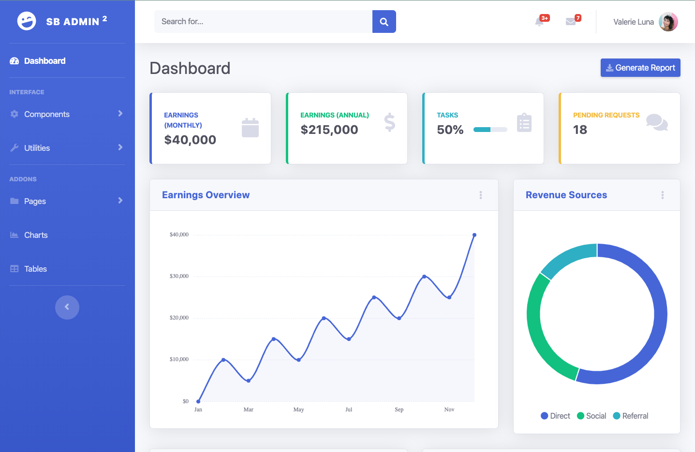

# 基于 Play Framework 的 Admin 模版

这是一个用 Play 框架实现的基于 [SB Admin 2](https://github.com/BlackrockDigital/startbootstrap-sb-admin-2) 的管理仪表盘（dashbaord）模版。SB Admin 2 是一个采用 [Bootstrap 4](https://getbootstrap.com/) 的开源模版。

## 1 如何使用

非常简单， Clone 之后在项目根目录运行： `sbt run`。

在 `http://localhost:9000/` 可以看到如下界面：



## 2 项目组成

基于 Play Framework。项目用 [compile-time DI](https://www.playframework.com/documentation/2.8.x/ScalaCompileTimeDependencyInjection) 和 [Macwire Macro](http://di-in-scala.github.io/)。  

客户端基于以下库：

- Bootstrap 4
- Chart.js
- Datatables
- fontawesome-free
- jQuery and jQuery-easing
- Bootstrap Admin temaplate

## 3 sbt 配置

Play Framework 采用了 MVC 结构，其项目结构不同于通常的 Scala 项目结构。sbt 遵循了 convention over configuration 原则，所以首先需要引入 Play 的 sbt plugin。

在项目根目录创建 `project\` 子目录，在此子目录下创建下面二个文件：

- `build.properties`: 设置 sbt 版本： `sbt.version=1.3.4`。
- `plugins.sbt`: 引入 Play 的 `sbt-plugin` 以及 `sbt-sassify`：

```scala
addSbtPlugin("com.typesafe.play" % "sbt-plugin" % "2.8.0")
addSbtPlugin("org.irundaia.sbt" % "sbt-sassify" % "1.4.13")
```

在根目录创建 `build.sbt`，加入下面内容：

```scala
name := """play-bootstrap4-admin"""

version := "0.0.1"

lazy val root = (project in file(".")).enablePlugins(PlayScala)

scalaVersion := "2.13.1"

libraryDependencies += "org.scalatestplus.play" %% "scalatestplus-play" % "4.0.3" % Test
libraryDependencies += "com.softwaremill.macwire" %% "macros" % "2.3.3" % "provided"

scalacOptions ++= Seq("-feature", "-deprecation", "-Xfatal-warnings")

// Client side
libraryDependencies += "org.webjars" % "jquery" % "3.4.1"
libraryDependencies += "org.webjars" % "jquery-easing" % "1.4.1"
libraryDependencies += "org.webjars" % "bootstrap" % "4.3.1"
libraryDependencies += "org.webjars" % "datatables" % "1.10.20"
libraryDependencies += "org.webjars" % "chartjs" % "2.8.0"
libraryDependencies += "org.webjars" % "font-awesome" % "5.11.2"
```

## 4 Play 程序

### 4.1 Controllers, Routes and Assets

Play 是个 MVC 框架。Controller 都很简单，直接返回各自的 View。

`views/main/main.scala.html` 定义了基本的 HTML 以及所有页面用到的 CSS 与 JS 资源。 `views/main/layout.scala.html` 则定义了总体布局，包括导航以及页头页尾。

`cong/rotues` 定义了所有路由。

`assets` 目录下面包含了用到个各种资源，包括图片，JS code 以及 SCSS 源代码。sbt 编译时会编译、拷贝和打包这些资源。

### 4.2 程序加载

Play 的文档 [Application entry point](https://www.playframework.com/documentation/2.7.x/ScalaCompileTimeDependencyInjection) 解释了使用编译注入需要了解的加载过程。Play 用 `ApplicationLoader` trait 定义应用的加载。其 `load` 方法的类型为 `Context => Application`。 `Context` 独立于具体应用，包含加载应用所需要的各种 Component。 这里，Component 是采用 [Think Cake Pattern](http://www.warski.org/blog/2014/02/using-scala-traits-as-modules-or-the-thin-cake-pattern/) 创建的包含所需依赖的 trait。 这些 trait 的名字通常用 `Components` 或 `Module` 作为结尾。

Play 提供了 `BuiltInComponentsFromContext` 作为父类帮助实现 `ApplicationLoader`。具体实现的子类需要提供最少二个所需要的模块：处理 Http 请求的处理链 `HttpFiltersComponents` 和定义的所有路由。 创建包含下面内容的 `app/MyApplicationLoader.scala` 文件, 其中包含了配置 Logger 的内容：

```scala
import _root_.controllers.AssetsComponents
import com.softwaremill.macwire._
import play.api.ApplicationLoader.Context
import play.api._
import play.api.routing.Router
import play.filters.HttpFiltersComponents
import router.Routes

class MyApplicationLoader extends ApplicationLoader {
  def load(context: Context): Application = new ApplicationComponents(context).application
}

class ApplicationComponents(context: Context) extends BuiltInComponentsFromContext(context)
  with ApplicationModule
  with AssetsComponents
  with HttpFiltersComponents
{

  // set up logger
  LoggerConfigurator(context.environment.classLoader).foreach {
    _.configure(context.environment, context.initialConfiguration, Map.empty)
  }

  lazy val router: Router = {
    // add the prefix string in local scope for the Routes constructor
    val prefix: String = "/"
    wire[Routes]
  }
}
```

上面用到的 `ApplicationModule` 包含了创建路由需要的所有 Controller instances。
一个 Play Web 应用需要创建所有的路由和所有的 Controller。创建包含下面内容的 `app/GreetingModule.scala` 文件生成所有 Controller:

```scala
import play.api.i18n.Langs
import play.api.mvc.ControllerComponents
import controllers.{Home, UIElements, Utilities, Pages, ChartTable}

trait ApplicationModule {

  import com.softwaremill.macwire._

  lazy val home = wire[Home]
  lazy val uiElement = wire[UIElements]
  lazy val utilities = wire[Utilities]
  lazy val pages = wire[Pages]
  lazy val chartTable = wire[ChartTable]

  def langs: Langs

  def controllerComponents: ControllerComponents
}
```

因为所有 Controller 的 Constructor 需要一个 `ControllerComponents` 类型的参数，这里需要给出抽象方法定义，否则会编译错误。具体的值，则在 mixin 这个 Component 的时候生成。

刚创立上面二个文件时，`import router.Routes` 和 `wire[Routes]` 在 IDE 里面会报告错误。原因是 Play 在编译初期需要从路由的定义文件 `conf/routes` 产生相关 Scala 代码。运行 `sbt compile` 产生所需的路由代码。

还需要指定加载程序，在 `conf/application.conf` 加入下面内容：`play.application.loader = MyApplicationLoader`。

现在可以运行 `sbt run` 检查生成的网站。用 `sbt dist` 可以生成可以部署的二进制代码（需要在命令行给出 Application secret 或 事先配置）。
